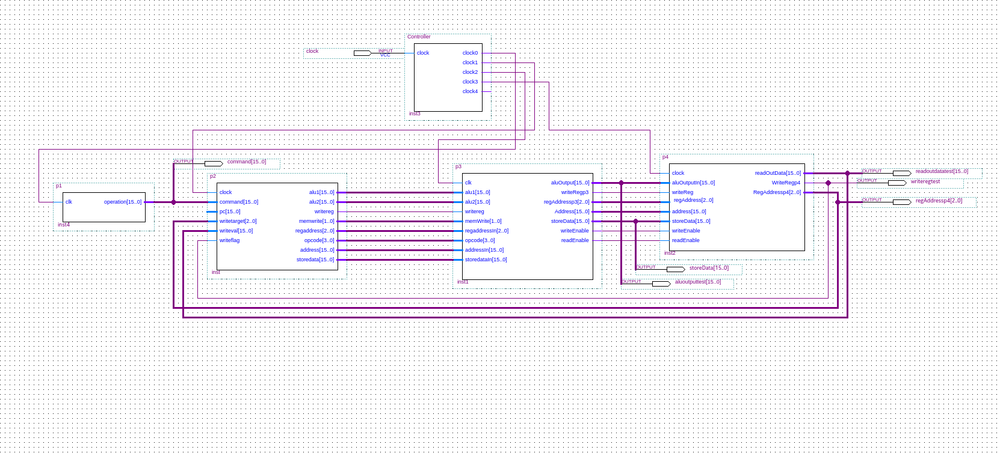

% 機能設計仕様書
% \西暦 \today
% 1029-28-9483 勝田 峻太朗

# 設計したモジュール

設計したモジュールは以下

+ `p2`
+ `Controller`
+ `Alu`(`p3`で使われている)
+ `main`(top level)

# p2

## コンポーネントの外部仕様

### 概要

このコンポーネントはレジスタを含む.
このコンポーネントの基本的な動作としては,命令を解釈すると同時に,後続の`p3`モジュールが必要とする値をレジスタから読み出す.

### 入力

このコンポーネントは,入力として,以下を受け取る.

clock(2bit)
: クロック

command(16bit)
: `p1`によって読み出された命令を入力とする.

writeflag
: レジスタに値を書き込むときは1,書き込まないときは0を入力.

writetarget(3bit)
: メモリから読んだ値を格納するレジスタの番号.(writeflag==1のときのみ)

writeval(16bit)
: レジスタに書き込む値.(writeflag==1のときのみ)

### 出力

alu1, alu2(16bit)
: 演算命令の場合,ALUが使用する値2つをレジスタや即値から取得する.

opcode(4bit)
: ALUで処理をする場合に,行うべき演算を示している.

| code |         計算          |
| ---- | --------------------- |
| 0000 |       in1 + in2       |
| 0001 |       in1 - in2       |
| 1000 |  in1 & in2 (bitwise)  |
| 1001 | in1 `|` in2 (bitwise) |
| 1010 |       in1 << i2       |
| 1011 |      in1 >> in2       |

: 演算コードの対応 {#tbl:opcode}


writereg(1bit)
: 演算または,ロード命令の場合,結果をレジスタに書き込む必要がある. 書き込む場合は1, 書き込まない場合は0である.

regaddress(3bit)
: writereg が1の場合,書き込む対象となるレジスタの番号を示す.

memwrite(2bit)
: メモリに行う操作をコードで表す. 何もしない場合は`00`,読み込み時は`01`,書き込み時は`10`を示す.

address(16bit)
: メモリに操作をを行う場合,どの番地に行うかを示している.

storedata(16bit)
: メモリに書き込みを行う場合,書き込む内容を示す.

## 内部仕様

入力として命令とクロックをを受け取り,出力レジスタに対して,クロックの立ち上がりとともに,対応するデータを書き込む. 書き込む値は,全て場合分け関数をもちいて出力される.

以下では,各出力を決定するために用いている関数を示す.

## レジスタ

レジスタをモジュール内に定義し,値を読み取るための関数`read`を定義した.

また,各レジスタの初期値は,テスト時の便利のため,レジスタ番号と同じ値に初期化している.


``` verilog
/////////////////
/// registers ///
/////////////////

reg [15:0] r0, r1, r2, r3, r4, r5, r6, r7;

// initial assignments for testing
initial begin
	r0 = 16'b0;
	r1 = 16'b1;
	r2 = 16'b10;
	r3 = 16'b11;
	r4 = 16'b100;
	r5 = 16'b101;
	r6 = 16'b110;
	r7 = 16'b111;
end

// read register value
function [15:0] read;
input [2:0] addressin;
	case (addressin)
	0: read = r0;
	1: read = r1;
	2: read = r2;
	3: read = r3;
	4: read = r4;
	5: read = r5;
	6: read = r6;
	7: read = r7;
	default: read = 16'b0;
	endcase
endfunction
```

## alu1,alu2,opcode

``` verilog
/////////////////
/// functions ///
/////////////////

//..

function [2:0] getaluaddress1;
input [15:0] command;
case (command[15:14])
	3: getaluaddress1 = command[13:11];
	0: getaluaddress1 = command[13:11];
	1: getaluaddress1 = command[13:11];
	default: getaluaddress1 = 3'b000;
endcase
endfunction

function [2:0] getaluaddress2;
input [15:0] command;
case (command[15:14])
	3: if (command[7:4] <= 4'd8) begin
			getaluaddress2 = command[10:8];
		end else begin
			getaluaddress2 = command[3:0];
		end
	0: getaluaddress2 = command[10:8];
	1: getaluaddress2 = command[10:8];
	default: getaluaddress2 = 3'b000;
endcase
endfunction

//..

always @(posedge clock) begin
    //..
	// get alu1 and 2
	alu1address = getaluaddress1(command);
	alu2address = getaluaddress2(command);
	alu1 = alu1val;
	alu2 = alu2val;
	opcode = command[7:4];
end

```

### writereg, regaddress

``` verilog

// function to get writereg
function getwritereg;
input [15:0] command;
	case (command[15:14])
		3: getwritereg = 1'b1;
		0: getwritereg = 1'b1;
		1: getwritereg = 1'b0;
		2: getwritereg = 1'b1;
		default: getwritereg = 1'b0;
	endcase
endfunction

// function to get regaddress
function [2:0] getregaddress;
input [15:0] command;
	case (command[15:14])
		3: getregaddress = command[10:8];
		0: getregaddress = command[13:11];
		2: getregaddress = command[10:8];
		default: getregaddress = 2'b00;
	endcase
endfunction

always @(posedge clock) begin
	//..
	// get register things
	writereg = getwritereg(command);
	regaddress = getregaddress(command);
end

```

### memwrite, address

``` verilog
// function to get memwrite
function [1:0] getmemwrite;
input [15:0] command;
	case (command[15:14])
		3: getmemwrite = 2'b00;
		0: getmemwrite = 2'b01;
		1: getmemwrite = 2'b10;
		2: getmemwrite = 2'b01;
		default: getmemwrite = 2'b00;
	endcase
endfunction

// function to get memory address
function [15:0] getaddress;
input [15:0] alu2;
input [15:0] command;
	case (command[15:14])
	0: getaddress = alu2 + signext8(command[7:0]);
	1: getaddress = alu2 + signext8(command[7:0]);
	2: getaddress = signext8(command[7:0]);
	endcase
endfunction

//..

always @(posedge clock) begin
	//..
	// get memory things
	memwrite = getmemwrite(command);
	address = getaddress(alu2val, command);
end

```

# Controller.v

## 外部仕様

### 概要

今後パイプラインプロセッサに進化させる可能性のあるもの,現状では,マルチサイクル方式のプロセッサであるため,各モジュール(`p1~p4`)に対して適切なクロックを流す必要がある.

このために,このモジュールはクロックを受け取り,各モジュールが適切なタイミングで処理をするように,generated clockを出力する.

### 入力

clock
: 供給されるクロック

### 出力

clock0
: p0に供給するクロック

clock1
: p1に供給するクロック

clock2
: p2に供給するクロック

clock3
: p3に供給するクロック

{#fig:controller-sim}

コントローラーの入力と出力は,[@fig:controller-sim]のようになる.

# Alu

## 外部仕様

### 入力

in1, in2(16bit)
: 計算する2つの数

opcode(4bit)
: 行う演算を表す数([@tbl:opcode]参照)

### 出力

result(16bit)
: 演算結果

v, z, c, s(1bit)
: 演算の条件コード(オーバーフロー,ゼロ,キャリー,サイン)


## 内部仕様

内部では,opcodeによる条件分岐により,異なった計算を行い,出力する.

``` verilog

// ..

// main function
function [15:0] calculate;
input [3:0] opcode;
input [15:0] in1;
input [15:0] in2;
begin
    case (opcode)
    0: calculate = in1 + in2;
    1: calculate = in1 - in2;
    8: calculate = in1 & in2;
    9: calculate = in1 | in2;
	 10: calculate = in1 << in2;
	 11: calculate = in1 >> in2;
	 15: calculate = in1;
	 default: calculate = 16'b0;
	 endcase
end
endfunction

assign result = calculate(opcode, in1, in2);

// ..

```

# main

## 外部仕様

クロックを入力とするプロセッサ.

## 内部仕様

main モジュールは,ブロック図で記述する.

構成は,各`p1~p5`とコントローラーから出力されるクロックを適切に配線する.

{#fig:main}

[@fig:main]中に見られる出力は,シミュレーションによる動作確認のためのものである.
