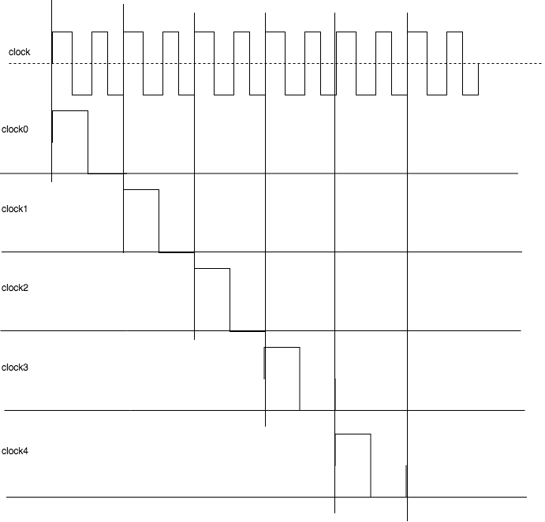

% 機能設計仕様書 最終 (Group18)
% 1029-28-9483 勝田 峻太朗
% \西暦 \today

\newpage

# 設計したコンポーネント

+ Controller
+ p1
+ p2

<!-- ===================== -->

# Controller

## 外部仕様

### 概要(追加分)

このモジュールは,入力されたクロックの半分の周波数のgenerated clockを出力する.

### 入力

clock
: 供給されるクロック

execbutton
: テンキーボタンからの入力

### 出力

clock0
: p1に供給するクロック(IF)

clock1
: p2に供給するクロック(ID)

clock2
: p3に供給するクロック(EX)

clock3
: p4に供給するクロック(MEM)

clock4
: p2に供給するクロック(WB)

execled(8bit)
: 7seg led上に現在のプロセッサの状態(実行中は’E’,停止中は’S’)を出力する.

resetled(8bit)
: 7seg led上にリセットボタン押下の状態(実行中は’E’,停止中は’S’)を出力する.

clockled(8bit)
: 7seg led上に現在のプロセッサの状態(動作中は’o’,停止後は’F’)を出力する.

## 内部仕様

### 構成部品

カウンターレジスタ(4bit)
: クロックを受け取り,現在どのフェーズなのかを保持する.

カウンターの値は,generated clockをきれいに出すために,2進表記それぞれ値が大きく異なる10つの値を順番にループし,generated clock出力をそれに応じて決定する.

<!-- ===================== -->

# p1

## 外部仕様

### 概要

PCを保持するとともに,命令メモリから,次に実行する命令を読み出す.

### 入力

clock0
: メモリ読み出し用のクロック

clock4
: PC更新用クロック

reset
: リセット信号を受け取る.

pcsrcin
: 分岐命令で,分岐することが確定した場合に1を受け取り,それに応じてpcを更新する.

pctargetin
: 分岐先アドレスの情報を受け取る.

### 出力

operation(16bit)
: 次行われる命令

## 内部仕様

### 構成部品

命令メモリ(1語16bit $\times$ 4096)
: 命令を保持する. 仕様として,0番地の命令は読まずに,1番地から命令を実行する.

PCレジスタ
: PCを保持する.

### 動作

#### clockp1

+ 立ち上がりで,命令メモリから値を読み出す.
+ 立ち下がりで,命令をレジスタに書き込む.

#### clockp4

+ 立ち上がりで,PCレジスタの値を更新する.

<!-- ===================== -->

# p2

## 外部仕様

### 概要

命令解釈をし,レジスタから必要な値を読み出すとともに,レジスタへの値の書き込みも別クロックでこのモジュール内で行う.

## 内部仕様

### 構成部品

レジスタ(16bit) 8本
:  プロセッサのレジスタ

### 動作

#### clockp2 

+ 立ち上がりで,命令を`p1`を取得し,各制御信号と値を取るべきレジスタの値を取得するし,パイプラインレジスタに書き込む.
+ 立ち下がりで,取得するべきレジスタの値を読み,パイプラインレジスタに書き込む.

#### clockp5

`clockp5`の立ち上がりでレジスタに書き込む値を決定し,立ち下がりで必要がある場合はレジスタに値を書き込む.

# 感想

+ とても盛りだくさんの実験で,とても忙しかった.
+ ハードウェアのことを少しよく知る事ができたのは,多少良かった.
+ もういいかなという感じ.
+ 共同開発が体験できたのは,ためになった.
