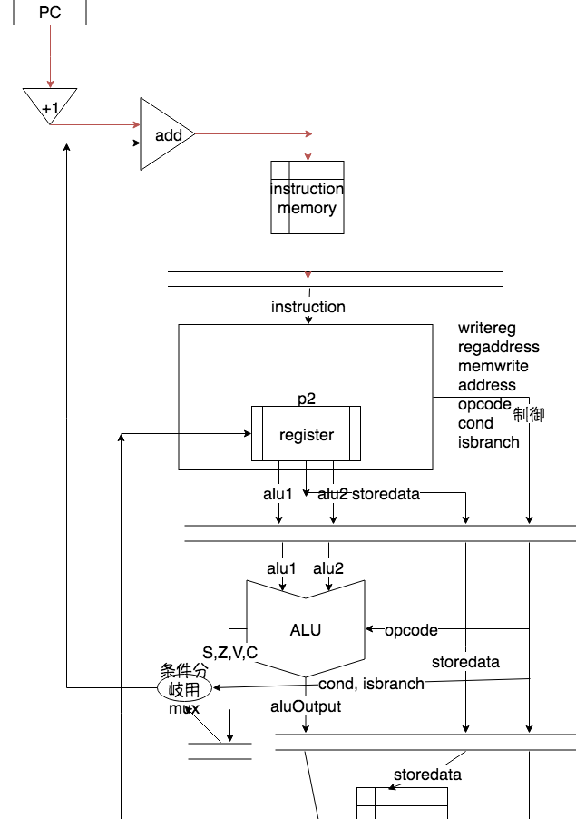
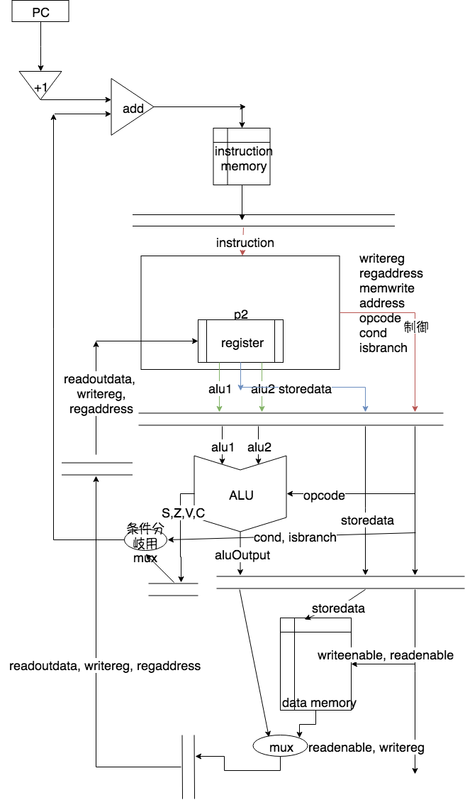

% 方式設計仕様書(Group18)
% 1029-28-9483 勝田 峻太朗
 1029-28-1547 住江 祐哉
% \西暦 \today

# 概要

設計したプロセッサは,5ステージのマルチサイクル方式のプロセッサである.


# 命令セットアーキテクチャ

SIMPLEアーキテクチャと基本的には同じである.
まず,以下のような命令の形式を定める.

## 形式

### R形式

```
#-----|----|----|-----|---#
| op1 | rs | rd | op3 | d |
#15---|13--|10--|7----|3--#
```

### I形式

```
#-----|----|----|-----|---#
| op1 | ra | rb |    d    |
#15---|13--|10--|7--------#
```

## 演算命令と停止･入出力命令

演算命令と停止･入出力命令では,R形式を用い,`op1`の値は`11`である.

| name | value                       |
| :--- | :-------------------------- |
| op1  | 11                          |
| rs   | レジスタ番号1               |
| rd   | レジスタ番号2               |
| op3  | 演算コード                  |
| d    | シフト演算のときのシフト数  |

: 演算命令のときの各値の対応 {#tbl:arithmetic-operations}

ただし,演算コードは以下のように定める.

| code | 計算                  |
| :--- | :-------------------- |
| 0000 | `in1 + in2`           |
| 0001 | `in1 - in2`           |
| 1000 | `in1 & in2 (bitwise)` |
| 1001 | `in1 | in2 (bitwise)` |
| 1010 | `in1 << i2`           |
| 1011 | `in1 >> in2`          |
| 1100 | 入力                  |
| 1101 | 出力                  |
| 1111 | 停止                  |

: 演算･停止･入出力コードの対応 {#tbl:opcode}

### 算術演算

算術演算は,演算コードが0で始まる.
このときの動作は,
$$ r[rd] = op3(r[rd], r[rs]) $$
である.

### ビット演算

ビット演算は演算コードが1ではじまる.
このときの動作は,
$$ r[rd] = op3(r[rs], d) $$
である.

### 停止/入出力命令

停止命令
: 動作を停止させることができる.

入力命令
: ボード上のスイッチを押すことで動作が開始するようにできるようにする.
$$ r[rd] = input $$

出力命令
: ボード上の7SEGLEDに指定したデータを出力できる.
$$ output = r[rs] $$

## ロード,ストア命令

ロード,ストア命令はI形式を用いる.

### ロード命令

ロード命令のとき, $op1 = 00$である.

行う動作は,
$$ r[ra] = *(r[rb] + signext(d)) $$

### ストア命令

ストア命令のとき, $op1 = 01$である.

行う動作は,
$$*(r[rb] + signext(d)) = r[ra]$$

## 即値命令･分岐命令

即値命令,分岐命令では,I形式を用いる.
また, $op1 = 10$ である.

| ニモニック | 説明       | 動作                                             | ra  | rb  |
| ---------- | ---------- | ------------------------------------------------ | --- | --- |
| LI         | 即値ロード | `r[rb] = signext(d)`                             | 001 | rb  |
| B          | 無条件分岐 | `PC = PC + 1 + signext(d)`                       | 100 | dc  |
| BE         | 条件分岐   | `if (Z) PC = PC + 1 + sign ext(d)`               | 111 | 000 |
| BLT        | 条件分岐   | `if (S ^ V) PC = PC + 1 + sign ext(d)`           | 111 | 001 |
| BLE        | 条件分岐   | `if (Z || (S ^ V)) PC = PC + 1 + sign ext(d)`    | 111 | 010 |
| BNE        | 条件分岐   | `if (!Z) PC = PC + 1 + sign ext(d)`              | 111 | 011 |

: 条件分岐･即値命令 {#tbl:load-branch}

## 制御回路

基盤上のプッシュスイッチをもちいて,以下の操作を可能にする.

### reset

基盤上のプッシュスイッチを1つ割り当て,スイッチが押されると1,離されていると0となるように設定する.
resetが1になると,プロセッサは初期化され,PCは0に戻る.

### exec

基盤上のプッシュスイッチを1つ割り当て,スイッチが押されると1,離されていると0となるように設定する.

+ プロセッサが停止状態にあるときにスイッチが押されると,プロセッサは動作を再開する.
+ プロセッサが動作状態にあるときにスイッチが押されると,プロセッサは実行中の命令を処理したあと,停止する.

# 構造と動作

## フェーズフローチャート 


## データフローチャート

データフローチャートは,[@fig:flow_p1], [@fig:flow_p2]に示される通りである.

{#fig:flow_p1}

{#fig:flow_p2}

[@fig:flow_p2]においては,

赤色
: ほとんど全ての命令で使われるパス

青色
: ストア命令で使われるパス

緑色
: 演算命令などで使われるパス

黄色
: 演算命令,ロード命令などで使われるパス

の対応をしている.

