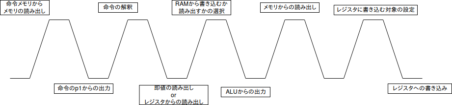

% ユーザーズマニュアル (Group 18)
% 1029-28-9483 勝田 峻太朗
 1029-28-1547 住江 祐哉
% \西暦 \today

\newpage

# 概要

# 性能と特徴

+ ほげほげ(mHz)の5段マルチサイクルプロセッサである.
+ ハーバード･アーキテクチャ
+ 16bit命令セット

# 命令セットアーキテクチャ

## 命令形式

命令形式は,以下の2つからなる.

```{#lst:r_inst caption="R形式"}
#-----|----|----|-----|---#
| op1 | rs | rd | op3 | d |
#15---|13--|10--|7----|3--#
```

```{#lst:i_inst caption="I形式"}
#-----|----|----|-----|---#
| op1 | ra | rb |    d    |
#15---|13--|10--|7--------#
```

## 命令の動作略記法

以下の図において,命令の動作を略記する際に以下の略記法を用いる.

| 略記法    | 意味                                                 |
| --------- | ---------------------------------------------------- |
| +         | 加算                                                 |
| -         | 減算                                                 |
| &&        | bitwise and                                          |
| `||`      | bitwise or                                           |
| ^         | bitwise xor                                          |
| signext() | 値を16bitへ拡張                                      |
| =         | 右辺の値を左辺に代入する                             |
| `*[<n>]`  | メインメモリの`<n>`番地に格納されているデータを示す. |
| `r[<n>]`  | `<n>`番レジスタに格納されている値を示す.             |

: 略記法一覧 {#tbl:notation}


## 算術･論理演算命令

算術演算命令には,以下のR形式の命令セットが用意されている.

| ニモニック | タイプ     | op1 | rs    | rd    | op3  | d     | 操作                                       |
| ---------- | ---------- | --- | ----- | ----- | ---- | ----- | ------------------------------------------ |
| ADD        | 算術演算   | 11  | input | input | 0000 | input | `r[rd] = r[rs] + r[rd]`                    |  |
| SUB        | 算術演算   | 11  | input | input | 0001 | input | `r[rd] = r[rs] - r[rd]`                    |  |
| AND        | 論理演算   | 11  | input | input | 0010 | input | `r[rd] = r[rs] && r[rd]`                   |  |
| OR         | 論理演算   | 11  | input | input | 0011 | input | `r[rd] = r[rs] || r[rd]`                   |  |
| XOR        | 論理演算   | 11  | input | input | 0100 | input | `r[rd] = r[rs] ^ r[rd]`                    |  |
| CMP        | 比較演算   | 11  | input | input | 0101 | input | `r[rd] - r[rs]`                            |  |
| MOV        | 移動演算   | 11  | input | input | 0110 | input | `r[rd] = r[rs]`                            |  |
| SLL        | シフト演算 | 11  | input | input | 1000 | input | `r[rd] = shift_left_logical(r[rd],d)`      |  |
| SLR        | シフト演算 | 11  | input | input | 1001 | input | `r[rd] = shift_left_rotate(r[rd], d)`      |  |
| SRL        | シフト演算 | 11  | input | input | 1010 | input | `r[rd] = shift_right_logical(r[rd], d)`    |  |
| SRA        | シフト演算 | 11  | input | input | 1011 | input | `r[rd] = shift_right_arithmetic(r[rd], d)` |  |

: 算術･論理演算命令 {#tbl:math_op}

### 条件フラグ

各演算において,プロセッサ内のレジスタに,それぞれ4つのフラグ`S`, `V`, `Z`, `C`を設定する.
これらは,条件分岐時に用いられる.

S
: 演算結果が負の場合1,そうでなければ0を設定する.

V
: 演算結果が符号付き16ビットで表せる範囲を超えた場合は1,そうでなければ0を設定する.

Z
: 演算結果がゼロならば1,そうでなければ0を設定する.

C
: 桁上げげあれば1,そうでなければ0を設定する.

### シフト演算

SLL(左論理シフト)
: 左シフト後,空いた部分の0を入れる.

SLR(左循環シフト)
: 左シフトによって空いた部分に,シフトアウトされたビット列を入れる.

SRL(右論理シフト)
: 右シフト後,空いた部分の0を入れる.

SRA(右算術シフト)
: 右シフト後,空いた部分に符号ビットの値を入れる.

## ロード･ストア命令

ロード･ストア命令には,以下のI形式の命令セットが用意されている.


| ニモニック | タイプ     | op1 | rs    | rd    | d     | 操作                             |  |
| ---------- | ---------- | --- | ----- | ----- | ----- | -------------------------------- |
| LD         | ロード命令 | 00  | input | input | input | `r[ra] = *[r[rb] + sign_ext(d)]` |  |
| ST         | ストア命令 | 01  | input | input | input | `*[r[rb] + sign_ext(d)] = r[ra]` |  |

: ロード･ストア命令 {#tbl:ld_st_op}

## 分岐命令

分岐命令には,以下のI形式の命令セットが用意されている.

| ニモニック | タイプ     | op1 | rs  | rd    | d     | 操作                                          |  |
| ---------- | ---------- | --- | --- | ----- | ----- | --------------------------------------------- |
| B          | 無条件分岐 | 10  | 100 | input | input | `PC = PC + 1 + sign_ext(d)`                   |  |
| BE         | 条件分岐   | 10  | 111 | 000   | input | `if (Z) PC = PC + 1 + sign_ext(d)`            |  |
| BLT        | 条件分岐   | 10  | 111 | 001   | input | `if (S ^ V) PC = PC + 1 + sign_ext(d)`        |  |
| BLE        | 条件分岐   | 10  | 111 | 010   | input | `if (Z || (S ^ V)) PC = PC + 1 + sign_ext(d)` |  |
| BNE        | 条件分岐   | 10  | 111 | 011   | input | `if (!Z) PC = PC + 1 + sign_ext(d)`           |  |

: 分岐命令 {#tbl:branch_op}

## 即値命令

即値命令には,以下のI形式の命令セットが用意されている.


| ニモニック | タイプ     | op1 | rs  | rd    | d     | 操作                          |
| ---------- | ---------- | --- | --- | ----- | ----- | ----------------------------- |
| LI         | 即値ロード | 10  | 000 | input | input | `r[rb] = sign_ext(d)`         |  |
| ADDI       | 拡張命令   | 10  | 001 | input | input | `r[rd] = r[rd] + sign_ext(d)` |  |
| SUBI       | 拡張命令   | 10  | 010 | input | input | `r[rd] = r[rd] + sign_ext(d)` |  |
| CMPI       | 拡張命令   | 10  | 011 | input | input | `r[rd] - sign_ext(d)`         |  |

: 即値命令 {#tbl:immidiate_op}

3つの演算拡張命令は,[@tbl:math_op]に示されているものと同様,4つの条件コードをレジスタに保存する.

## その他の命令

その他の命令には,以下のR形式の命令セットが用意されている.

| ニモニック | タイプ     | op1 | rs    | rd    | d    | op3   | 操作           |  |
| ---------- | ---------- | --- | ----- | ----- | ---- | ----- | -------------- |
| IN         | 入出力命令 | 11  | input | input | 1100 | input | r[rd] = input  |  |
| OUT        | 入出力命令 | 11  | input | input | 1101 | input | output = r[rs] |  |
| HLT        | 入出力命令 | 11  | input | input | 1111 | input | HALT           |  |

: その他命令 {#tbl:etc_op}

### IN命令

IN命令は,基板上のディップスイッチで,ディップスイッチによって表された16ビットの値が,`rd`で指定されたレジスタに代入される.

### OUT命令

OUT命令では,指定されたレジスタに格納されている値を,`MU500-7SEG`ボード上の,7SEG-LED部,`A0`から`A3`までに,16進数で表示する.

### HLT命令

HLT命令では,各モジュールに出力される generated clockを停止することで,プロセッサの処理を停止する.

# 構造
このプロセッサはステージ4つ(p1~p4)とコントローラに分かれている  
それらの機能を以下で説明する  

## IF:命令フェッチ(p1.v)

プログラムカウンタ、プログラムの命令が書かれた大容量メモリを含むモジュールである.  
マルチプレクサ、加算器も含む.  
このモジュールで16bit固定長命令が書かれたプログラムを命令メモリから読み出し、このプロセスで行う命令を決定する.

## ID&WB:命令デコードとレジスタフェッチ(p2.v)

読み出したり、書き込んだりするためのデータが保存されたレジスタ、符号拡張器が含まれているモジュールである.  
このモジュールではレジスタからの読み出し・書き込みと、命令に書かれている定数のビット変換(拡張)を行う.  
制御もここで入力を受け取って行う.  
ただし、命令の解釈/レジスタからの読み出し/レジスタへの書き込みのタイミングが異なり、それは後述する.  

## EX:命令実行とアドレス生成(p3.v)

ここで演算命令の演算を行う.  
ビットシフタ、加算器、ALU、マルチプレクサが含まれる.  
演算結果により、4種類のフラグ(v,z,c,s)を決定し、条件分岐命令で使用する.  
また、出力命令による7SEG LEDへの出力の制御もこのステージで行われている.  　　

## MEM:メモリ・アクセス(p4.v)

データメモリとそれに読み込む/書き込む機能を持つ.

## コントローラー(Controller.v)

全体に適切なクロックを送り,マルチサイクル実行を実現するモジュール.
プロセッサ全体の実行,停止,リセットもこのモジュールで扱う.  

# 動作
ステージ自体は4つに分かれているが、動作としては5サイクルである



